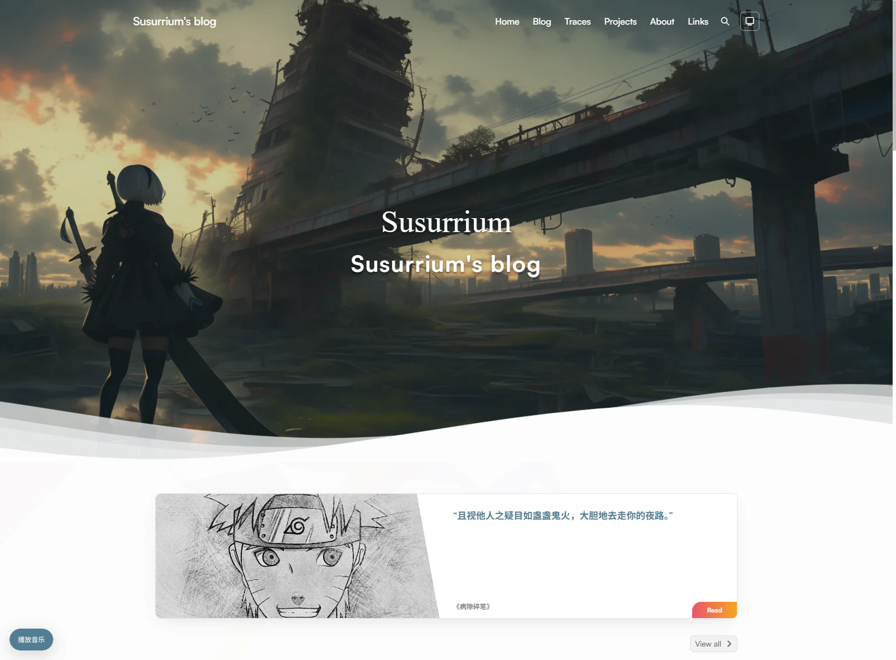
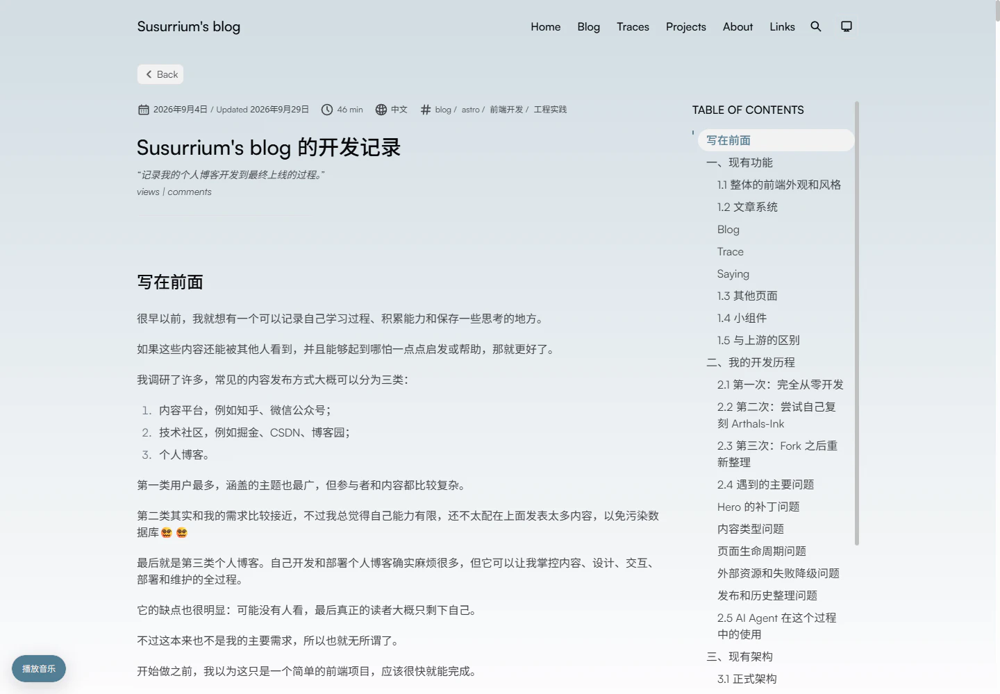
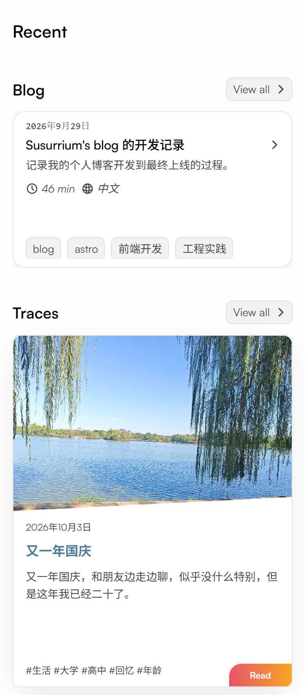
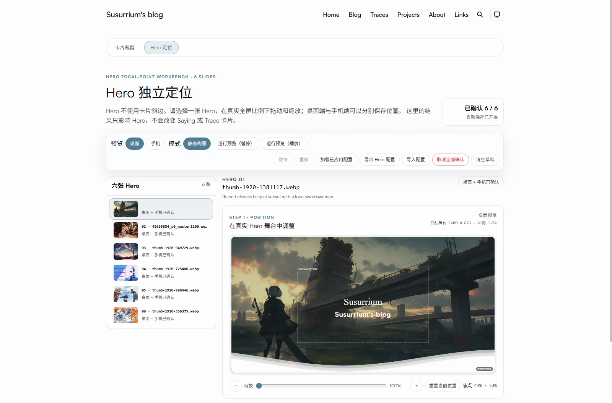

# Susurrium Blog

Susurrium 的个人博客，围绕长文写作、生活记录和引文收藏组织内容，同时展示个人介绍、项目与友链。

项目由 [Arthals-Ink](https://github.com/zhuozhiyongde/Arthals-Ink) Fork 开发，使用 Astro 与 astro-pure，静态构建并部署于 GitHub Pages。

[访问网站](https://susurrium.github.io/) · [正文首页](https://susurrium.github.io/home)



_首页以图片轮播开场，通过波浪过渡到随机引文和后续内容。_

## 网站特点

### 文章、记录与引文

- **Blog**：长文、学习笔记和项目总结，以文字卡片和完整文章页面呈现。
- **Trace**：生活、思考与过程记录，支持独立封面，使用带图卡片展示。
- **Saying**：收藏短句与引文，保留原文、作者、出处及补充说明，首页随机展示其中一条。

三类内容分别拥有列表、分页和标签，统一全文搜索支持按内容类型与标签筛选。Blog 阅读页提供文章目录、阅读时间、数学公式、代码高亮与复制、图片放大，以及版权与分享区域；内容页面可通过评论交流。RSS 默认收录 Blog。

### 首页与个人展示

独立的视频与打字动画入口连接正文首页。首页将图片轮播、随机 Saying、个人简介、最近 Blog 与 Trace、Blog 时间线组织在一起，并展示教育信息、居住地地图和 GitHub 贡献日历。

About 介绍个人情况、使用的工具与联系方式，Projects 展示项目，Links 提供友链浏览与交换信息。

### 浏览体验

支持浅色、深色和跟随系统的主题设置，适配桌面与手机。音乐在用户启动后可跨站内页面继续播放；背景、花瓣和点击效果按页面与设备条件启用，阅读页关闭装饰效果，并遵循减少动画偏好。

## 阅读与手机端展示



_桌面阅读页将正文与章节目录并列，保留标题、日期、标签和阅读时间。_

<p align="center">
  <a href="./.github/assets/readme/home-mobile.webp">
    
  </a>
</p>

_手机端的最近内容按单列排列，分别呈现 Blog 文字卡片与 Trace 封面。以上展示图来自同一份本地生产构建。_

## 维护支持

- **内容与素材**：使用 Markdown／MDX 文件写作，提供新建草稿、日期维护和本地图片处理工具；首页 Hero 图片可生成响应式候选。
- **媒体工作台**：拖动与缩放卡片图片，分别调整 Hero 的桌面和手机定位，保存确认历史、导入导出编辑记录，再通过脚本应用到网站。操作见[工作台指南](./docs/MEDIA_WORKBENCH.md)。
- **构建与发布**：检查文档、代码、类型、构建产物和资源体积，并通过浏览器回归检查关键交互；GitHub Pages 从 `main` 手动部署。

<details>
<summary>查看媒体工作台：Hero 定位模式</summary>



_在真实首页舞台中预览构图，可切换桌面与手机尺寸。_

</details>

## 快速开始

准备 Git、[指定版本的 Node.js](./.node-version) 和 [`packageManager` 指定的 Bun](./package.json)，在仓库根目录运行：

```powershell
bun install --frozen-lockfile
bun run dev
```

打开终端显示的地址；`/` 是入口页，`/home` 是正文首页。构建、生产预览和 Windows 环境说明见[本地运行](./docs/DEVELOPMENT.md#环境与本地运行)。

## 按任务阅读

| 任务                                             | 入口                                    |
| ------------------------------------------------ | --------------------------------------- |
| 写文章、添加封面和正文图片、预览并准备发布       | [内容写作指南](./docs/CONTENT.md)       |
| 修改网站资料、维护素材、运行检查、管理分支与部署 | [开发与维护指南](./docs/DEVELOPMENT.md) |
| 修改内容模型、组件、阅读页面或客户端交互         | [架构说明](./docs/ARCHITECTURE.md)      |

普通页面会过滤草稿；预览与发布步骤分别见内容、开发指南。

## 专项与参考资料

- [来源台账](./docs/SOURCE_LEDGER.md)：参考实现、素材、固定版本和核验证据。
- [第三方素材说明](./docs/THIRD_PARTY_NOTICES.md)：许可、署名和授权范围。
- [历史文档索引](./docs/archive/README.md)：阶段方案、审计、决定与验证记录。

仓库保留的 [Pure 历史源码说明](./packages/pure/README.md) 供追溯参考，当前实现与依赖关系见架构说明。

## 许可与联系

- 代码保留上游 [Apache-2.0 许可证](./LICENSE)。
- 文章版权组件使用 [CC BY-NC-SA 4.0 声明配置](./src/data/content-license.ts)，引用内容遵循原作者的权利与声明。
- 第三方素材适用各自许可，详见[第三方素材说明](./docs/THIRD_PARTY_NOTICES.md)。
- 问题与功能建议通过本仓库 Issues 反馈；社区行为与私下反馈渠道见[行为准则](./CODE_OF_CONDUCT.md)。
