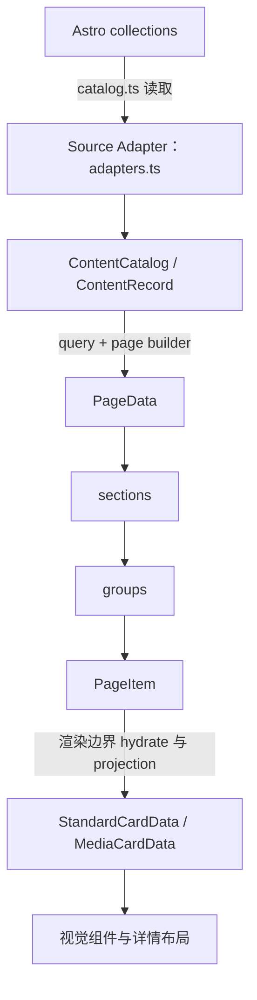
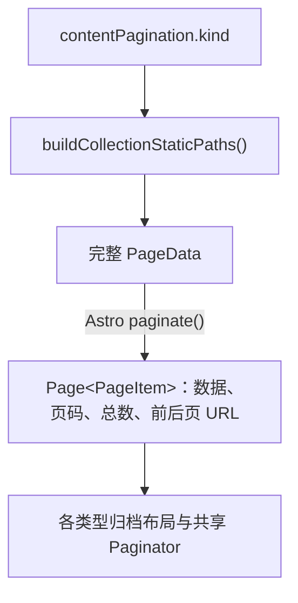

# 架构说明

本文解释内容、页面、媒体和客户端交互的设计契约。操作与检查方法见 [开发指南](./DEVELOPMENT.md)，作者字段用法见 [内容指南](./CONTENT.md)。修改实现时同步核对设计要求、当前代码与行为验证，具体差异按已明确需求处理。

## 1. 目标与范围

### 1.1 目标

- 将 Blog、Trace、Saying 的内容读取、筛选、排序、路由和卡片字段转换收敛到一个内容层。
- 固定所有列表页和详情页的外层层级：

  ```text
  PageData → sections → groups → items
  ```

- 让页面只决定“这一组内容在本页面中的含义”，不再直接理解三个 collection 的 frontmatter。
- 对于视觉完全相同的卡片，只保留一个视觉组件和一个公共数据契约。
- 保留现有成熟卡片、详情阅读界面、布局、动画和响应式行为的渲染基线。

### 1.2 范围

本次统一的内容类型和入口如下：

| 内容类型 | 内容集合 | 公开路由     | 默认排序                                     |
| -------- | -------- | ------------ | -------------------------------------------- |
| Blog     | `blog`   | `/blog/*`    | 编辑日期倒序（`updatedDate ?? publishDate`） |
| Trace    | `trace`  | `/traces/*`  | 发布时间倒序                                 |
| Saying   | `saying` | `/sayings/*` | 稳定 `id` 正序                               |

已纳入统一层的页面包括 Home、Blog 列表、标签页、归档页、Trace 列表、Saying 列表、三类详情页和 RSS。`docs` collection 独立定义在 schema 中，对应当前尚未提供的 `src/content/docs/`；根目录 `docs/` 保存工程文档。

### 1.3 明确不做的事情

- 不把三个物理 collection 合并成一个 Markdown 目录；它们的 schema 和正文形态仍然独立。
- 不把视觉不同的卡片强行做成一个巨型组件。
- 不为了“统一数据”重写卡片视觉、动效或详情布局；列表项和标题等语义修复可以在保留视觉的前提下完成。
- 不把原始 Astro collection entry 放进 `PageData` 静态路径 props。

## 2. 不可破坏的视觉基线

“视觉不变”以生产构建后的 DOM、class、资源选择、响应式断点和交互契约为基线，而不是以旧的数据耦合方式为基线。

以下实现是默认配置下的视觉基线。修复数据、列表语义、标题层级和无障碍属性时应保留其外观与交互：

- 文本卡片视觉族：`TextCard.astro`。它是唯一的通用文本卡片渲染器；`BlogTextCardAdapter.astro` 只作为 Blog 阅读时间等构建期元信息的兼容适配器，最终视觉仍落到同一套文本卡片结构。
- `TextCardCompat.astro` 保留为旧调用的兼容门面；视觉相同的无图文案统一通过 `StandardCardData` 输入。
- Trace 卡片：`TraceCard.astro` → `MediaCard.astro`。
- Saying 卡片：`SayingCard.astro` → `MediaCard.astro`，继续使用装饰图策略。
- Media 的 CSS、移动端纵向布局和镜像视觉；图片选择统一按第 7.2 节执行，真实封面优先。
- Blog 详情：`BlogPost.astro` 及其正文、目录、版权卡片、图片缩放和阅读背景行为。
- Trace 详情：`TracePost.astro` 的阅读界面和导航行为；文章底部版权卡片按策略关闭。
- Saying 详情：`SayingPost.astro` 的原文/译文、署名和阅读界面；文章底部版权卡片按策略关闭。
- Home 的 Hero、Recent 两列、随机 Saying、Timeline，以及现有布局 CSS 和客户端脚本。

默认配置保留上述视觉和交互结果；显式 surface 或 presentation 配置可以隐藏入口、停止生成页面或选择其他已有视觉族。详情页保留正文渲染所需的 raw entry，但只能在渲染边界通过稳定 key 回查，不能成为页面数据层的公共结构。

## 3. 四层职责与唯一数据流

统一层采用单向数据流：



四层的职责必须保持分离：

1. **Source 层**：只负责 Astro collection entry 和 schema。
2. **Content 层**：把不同 schema 转成统一的内容语义；不包含页面位置和 CSS 决策。
3. **Page 层**：决定 section、group、顺序、分页、关联内容和本页面的含义。
4. **Presentation 层**：把内容语义投影成某个视觉原语需要的字段；不再读取 frontmatter。

生产代码中，只有 `src/lib/content-layer/catalog.ts` 可以直接调用 `getCollection()`。页面、卡片和普通组件不得直接读取 `blog`、`trace` 或 `saying` collection。

## 4. 内容层的固定契约

### 4.1 ContentRecord

统一内容本体是带判别字段的联合类型：

```ts
type ContentRecord = BlogRecord | TraceRecord | SayingRecord
```

完整类型见 [types.ts](../src/lib/content-layer/types.ts)。公共记录以 `${kind}:${id}` 为跨页面稳定 key，`id` 对应 collection ID 与详情路径；`title` 表达内容主标题，`cardTitle` 表达卡片标题。日期允许缺省，以适应无日期的 Saying。标签与草稿状态在内容层统一处理。

类型专属字段只放在对应的分支中：

- `BlogRecord`：`language`、`comment`、`image`。
- `TraceRecord`：`image`。
- `SayingRecord`：`originalText`、`author`、`source`、`sourceUrl`。

适配器位于 `src/lib/content-layer/adapters.ts`。适配器只做字段语义转换，不决定某个页面显示为哪种卡片。

### 4.2 ContentCatalog

`loadContentCatalog()` 是所有公开内容查询的入口，默认 `mode: 'published'`，因此公共页面不会显示 draft。只有明确的 preview 调用才可以包含 draft。同一构建上下文按 `published/preview` 分别缓存目录，读取失败会清除对应缓存；这只优化构建，不改变内容结果。

Catalog 保存 mode、全体记录和按 kind 分类的记录；结构定义见 [types.ts](../src/lib/content-layer/types.ts)，读取与缓存见 [catalog.ts](../src/lib/content-layer/catalog.ts)。

`LoadedContentCatalog` 另外保存 `sources.byKind`，以及两张以 `${kind}:${id}` 为键的 Map：

```ts
recordsByKey: ReadonlyMap<string, ContentRecord>
sourcesByKey: ReadonlyMap<string, AnyContentEntry>
```

`hydratePageItem()` 通过 `recordsByKey.get()` 回查内容，`getSourceEntry()` 通过 `sourcesByKey.get()` 回查原始 entry，避免每个卡片都扫描整个集合。Map 只存在于构建期 catalog，不进入 `PageData` 或静态路径 props。公开页面仍通过默认的 published catalog 排除草稿；当前没有根据未来发布日期自动延迟发布的功能。

查询统一使用 `queryContent()` 和 `sortContentRecords()`：

- `editorial-date-desc`：`updatedAt ?? publishedAt` 倒序；并列时用稳定 key 排序，不依赖加载器枚举顺序。
- `publish-date-desc`：`publishedAt` 倒序；并列时用稳定 key 排序。
- `id-asc`：稳定 key 正序，适用于无日期的 Saying。
- 筛选、标签匹配、offset、limit 都在同一查询策略中完成。

### 4.3 内容校验和日期

`src/lib/content-validation.ts` 提供共享的非空文本、标签、来源链接和编辑日期校验。标题和描述等已声明文本会先 trim；标签单项最长 80 字符，拒绝纯空白，经过 NFC 规范化、小写化和去重。Blog、Trace 及带日期的 docs 都拒绝 `updatedDate < publishDate`。Saying 的 `sourceUrl` 仅接受 HTTP/HTTPS。

`src/lib/content.ts` 的 `contentTimeZone` 与 `src/site.config.ts` 的 `theme.locale.dateOptions.timeZone` 当前都为 `Asia/Shanghai`。内容日期显示、归档年份和 Home 时间线遵循该时区；`datetime` 与 RSS 时间戳仍使用对应的标准时间表示。GitHub 贡献日历使用服务返回的日期键并按 UTC 格式化，是独立的数据约定。

Blog 的本地 `heroImage.src` 是 Astro `ImageMetadata`，不是整个 `heroImage` 对象的字符串字段。适配器从 `heroImage.src` 提取资源 URL，阅读页开图保留原始 metadata 供 Astro 图片组件处理；OG 图、卡片和 RSS 使用同一内容封面来源。

## 5. PageData 的固定层级

页面可以给 section 和 group 起不同的业务名称，但不能改变外层结构：

`PageData.page` 保存页面类型与路由；`sections`、`groups` 各自保存稳定 key 与 meaning，表达当前页面的组织语义。每个 `PageItem` 只保存自身 key、contentKey 与 placement。完整类型和构造器分别见 [types.ts](../src/lib/content-layer/types.ts) 与 [page-data.ts](../src/lib/content-layer/page-data.ts)。

`PageItem` 是页面树中的轻量引用。需要渲染时，`hydratePageItem()` 才在构建期边界回查 `ContentRecord`、必要的 raw Astro entry，并生成 `StandardCardData`；因此 `ResolvedPageItem`/`RenderablePageItem` 属于渲染输入，不属于 `PageData` 本体。

这里的“统一”是结构统一，不是语义抹平：

- Home 的 `recent-writing/blog` 表示最近 Blog。
- Home 的 `recent-writing/trace` 表示最近 Trace。
- 归档页的 `year-2026/posts` 表示 2026 年 Blog。
- 详情页的 `article/primary` 表示当前正文，`related/*` 只携带当前条目及前后相邻条目的窗口。

这些含义通过 `key` 和 `meaning` 表达；内容记录本身不需要为每个页面增加 `homeTitle`、`archiveTitle`、`detailTitle` 等页面专用字段。

页面构造统一使用 `createPageItem()`、`createPageGroup()`、`createPageSection()`、`createPageData()` 及相应的 `build*PageData()`。页面只负责选择记录和传递页面级 placement（例如 `detailed`、`headingLevel`、`presentation`、`actionLabel`）。

详情路由先对本类型内容排序，再通过 `adjacentContentRecords(records, index)` 取得最多三条记录：上一条、当前条目、下一条。边界页只有两条，单条集合只有一条。当前条目保留在窗口中，供公共导航及 Blog 的 `ArticleBottom` 适配器定位。路径 props 不再为每篇文章复制整个集合，渲染阶段也只 hydrate 该窗口；所有详情页关联引用总量随内容条数线性增长。

当前 `recommendations` 名称保留兼容性，Blog 基线实际展示前后篇；切换到通用推荐卡片时，也只展示传入窗口中的相邻内容。若未来实现按标签评分的推荐，应新增有明确数量上限的查询，不能重新把整个集合嵌入每页。

### 5.1 历史展示值的兼容边界

改名不会让历史页面配置失效。`src/lib/compatibility/content-presentation.ts` 是唯一接受旧展示值的输入边界：它把 `arthals-text`、`large-skull-content`、`large-skull-decorative` 分别归一化为 `text`、`media-content`、`media-decorative`。`resolvePresentation()` 和 `createPageItem()` 在进入内容层/页面树前完成归一化，之后只允许流通 canonical union；未知值回退到调用方提供的安全默认值。

兼容映射不应复制到 `ContentPresentation` 类型、内容类型注册表或视觉组件中。这样既能读取历史 JSON/Astro props，也不会让来源项目名称重新成为新的应用级 API。

分页器自身的 `currentPage`、`prev/next URL` 以及侧栏计数属于 Astro 路由/视图控制信息，可以作为页面 props 保留；它们不能改变内容条目的统一 `PageData` 层级，也不能重新携带 collection entry。

## 6. 卡片组件规则：相同视觉只做一个，不同视觉分别保留

这是本次方案最重要的边界。

### 6.1 真正相同的卡片

如果 Blog、Trace、Saying 在某种页面中需要完全相同的视觉，则它们都先投影为同一个：

`StandardCardData` 保存内容身份、标题、链接、页脚文字和可选的日期、摘要、图片。具体定义及投影见 [types.ts](../src/lib/content-layer/types.ts) 与 [card-data.ts](../src/lib/content-layer/card-data.ts)。

然后由一个 `TextCard` 渲染（旧调用通过 `TextCardCompat` 兼容门面转入同一实现）。组件只认识这组稳定字段，不认识 Blog frontmatter、Trace schema 或 Saying schema。因此新增第四种内容类型时，只需新增适配器和 `toStandardCardData()` 的映射，不需要复制一份同样的卡片。Blog 需要阅读时间时，只有 `ContentCard` 在 render boundary 将该元信息交给同一文本卡片 renderer；这不是第二套视觉实现。

### 6.2 视觉不同的卡片

视觉不同就保留不同的组件/适配器：

| 适配组件              | 渲染组件    | 输入职责                   |
| --------------------- | ----------- | -------------------------- |
| `BlogTextCardAdapter` | `TextCard`  | 补充 Blog 阅读时间等元信息 |
| `TraceCard`           | `MediaCard` | 内容图片或备用图           |
| `SayingCard`          | `MediaCard` | 装饰图与 Saying 署名       |

TraceCard 和 SayingCard 接收 `MediaCardData`，共用 `MediaCard` 视觉原语；各自的 frontmatter 由内容层适配。

### 6.3 Blog 卡片的受控例外

Blog 的 `BlogTextCardAdapter` 仍接收原始 Blog entry，是因为它需要 Astro `render(post)` 相关的阅读时间/正文元信息，并且要锁定当前成熟输出。它是一个明确隔离的增强视觉适配器，不代表其他卡片可以重新直接读取 collection。

`ContentCard` 是唯一的页面级 presentation host：新代码传入一个 `RenderablePageItem`，它根据已经解析好的 `placement.presentation` 选择视觉族。Blog 的阅读时间在 Blog 兼容适配器的渲染边界补入；Trace/Saying 通过同一个 `MediaCard`。旧 props 仅作为迁移兼容入口，内部立即转换为同一个 `PageItem`，不得继续扩展第二套渲染逻辑。

### 6.4 列表容器和标题语义

`ContentCard` 接受 `as='li' | 'article'` 并向各视觉族透传。`ul` 的直接子卡片必须传 `as='li'`，包括标签页、Blog 列表、年份归档、Home Blog 列表和通用推荐列表；普通内容区可以使用 `article`。不能根据“默认是 Blog 卡片”来假定渲染结果一定为 `li`，因为 presentation 可以改变。

文字卡片和 Media 卡片都使用 `placement.headingLevel` 决定标题级别。归档及标签页卡片为 h2，Home 的 Recent 子栏目下为 h4。正文模板从 h2 开始，页面主标题由阅读 header 提供。标签 `plain` 模式保留可读文字而不生成链接；`hidden` 模式隐藏卡片标签文字。

## 7. 各页面的实现约定

| 页面          | PageData 组合                                                                                       | 内容来源/排序                                        | 视觉边界                                                               |
| ------------- | --------------------------------------------------------------------------------------------------- | ---------------------------------------------------- | ---------------------------------------------------------------------- |
| Home          | `featured-saying/candidates`、`recent-writing/blog`、`recent-writing/trace`、`blog-timeline/year-*` | Blog/Trace 按发布时间；Saying 按 id                  | 现有随机 Saying、Blog 卡片、Trace Media、Timeline 不变                 |
| Blog 列表     | `content/items`                                                                                     | Blog 编辑日期倒序；独立 pageSize 分页                | 现有 Blog 卡片 DOM/CSS 不变                                            |
| Blog 标签页   | `content/items`                                                                                     | Blog 编辑日期倒序后按 tag 筛选                       | 与 Blog 列表相同，路由 `/blog/tags`                                    |
| Trace 标签页  | `content/items`                                                                                     | Trace 发布时间倒序后按 tag 筛选                      | 与 Trace 列表相同，路由 `/traces/tags`                                 |
| Saying 标签页 | `content/items`                                                                                     | Saying 稳定 ID 顺序后按 tag 筛选                     | 与 Saying 列表相同，路由 `/sayings/tags`                               |
| 归档页        | 每年一个 `year-YYYY/posts`                                                                          | Blog 编辑日期倒序后按年份分组                        | 现有年份标题和卡片间距不变                                             |
| Trace 列表    | `content/items`                                                                                     | Trace 发布时间倒序；独立 pageSize 分页               | 现有 Trace/Media 输出不变                                              |
| Saying 列表   | `content/items`                                                                                     | Saying id 正序；独立 pageSize 分页                   | 现有装饰卡片输出不变                                                   |
| 三类详情      | `article/primary` + `related/*`                                                                     | 各自类型的详情排序                                   | 共用阅读壳层；Blog 保留版权卡片，Trace/Saying 按策略关闭，其余布局不变 |
| RSS           | 不渲染 PageData                                                                                     | 启用 rss surface 的内容，编辑日期倒序；默认只有 Blog | 复用正文编译结果并转换成适合订阅读器的 HTML                            |

### 7.1 归档分页能力与独立参数

Blog、Trace、Saying 的主归档都使用同一套分页流程，但保留各自的页面外观和排序规则：



- 分页器组件由 `astro-pure` 提供，站点只负责把 Astro 的 `page.url.prev/next` 转换成统一的 `← Previous` / `Next →` 按钮；类型差异只出现在无障碍标签中。
- 共享逻辑位于 `src/lib/content-layer/pagination.ts`，只统一“排序、完整 PageData、切页、Paginator props”这条数据链，不统一三类页面的 DOM 或视觉。
- 每种内容类型在 `src/site.config.ts` 的 `contentPagination` 中单独设置 `enabled` 与 `pageSize`。例如 `contentPagination.trace.pageSize = 8` 不会影响 Blog 或 Saying。
- `enabled: false` 表示该类型仍走同一条构造链，但输出单页完整归档；重新开启时无需改路由。
- `/traces`、`/sayings` 由 `[...page].astro` 同时承载首页和数字页（如 `/traces/2`）；详情页仍由各自的 `[...slug].astro` 承载。为避免数字文章 ID 与分页路径冲突，启用分页时内容 ID 不能是纯数字。
- 标签结果页也复用同一页大小解析规则，但可在调用处传入不同参数，因此“主归档参数”和“标签结果参数”仍可独立演进。

详情页的 `PageData` 负责当前条目、关联条目和页面语义；正文渲染前通过 `getSourceEntry(catalog, kind, id)` 回查 raw entry，再在渲染边界投影为 `ReadingHeaderData`。raw entry 只用于正文渲染和无法提前得到的构建元信息，不进入公共页面数据或阅读组件。

### 7.2 Trace 和 Saying 的跨页面图片映射

`buildTraceImageAssignmentMap()` 在完整 Trace 集合上按发布时间及稳定 key 排序，再生成归档交替备用图映射。Home、主归档、标签页和详情首图复用该映射；不能再使用各页局部下标或另一个哈希规则单独选图。

真实 Trace `cover` 始终优先。映射不为有封面的记录覆盖内容图片，`resolveMediaImage()` 也先检查真实封面，因此作者提供的 `coverAlt` 和非装饰性图片语义得以保留。缺少封面的记录才使用装饰性的备用图。

此映射保证同一次构建内跨页面一致，同时保留归档交替视觉；它不是持久化的条目—图片绑定。新增较新的 Trace 会改变队列位置，可能改变旧条目的备用图。若需要永久固定配图，应提供真实 `cover`，或另行设计明确的持久化配图配置。

Saying 使用 `buildSayingImageAssignmentMap()`，在完整的稳定 ID 顺序上生成装饰图片映射，并在 Home、归档、标签和详情之间复用。正文图片与这些卡片裁剪决策相互独立。

### 7.3 RSS 的正文复用和资源地址

`src/pages/rss.xml.ts` 先根据 `rss` surface 筛选 catalog，调用 Astro `render(entry)`，再由 Astro Container 渲染正文；Container 注册 MDX renderer。RSS 不再从 `post.body` 运行一套缺少站点插件的 Markdown 解析器，因此 GFM 表格、提示块、数学公式和 MDX 表达式使用与阅读页相同的编译结果。

`src/lib/rss-content.ts` 对渲染后的 HTML 做订阅读器投影：

- 保留正文、表格、引用及可读提示块；数学公式保留 MathML，移除依赖站点 CSS 的重复 KaTeX HTML 层。
- 移除脚本、样式、复制按钮和无用的响应式候选，再用允许列表清洗 HTML。客户端交互不进入 RSS；阅读器不支持的交互仍可通过条目链接回到原文。
- 普通图片与链接转成绝对 URL；尚未由 Astro 转换的源文件相对图片，以 `entry.filePath` 的物理目录查找资源，不从公开 slug 猜测目录。
- 指向源 Markdown/MDX 的相对链接通过 source 文件路径映射到真实内容 href，并保留查询串和片段。
- 有封面时把内容封面加入订阅正文；显式启用 Saying RSS 时补入引文与署名。默认只收录 Blog，不再生成缺失必需属性的 enclosure 元素。

RSS 条目沿用编辑日期排序和时间戳策略；没有日期的 Saying 不伪造日期。`rss` 开关控制条目收录，站点级 `/rss.xml` 入口保留，即使最终没有条目也输出有效空 feed。

## 8. 代码组织与新增内容类型流程

统一层位于 `src/lib/content-layer/`：

| 文件                | 职责                                                    |
| ------------------- | ------------------------------------------------------- |
| `types.ts`          | ContentRecord、PageData、卡片输入契约                   |
| `adapters.ts`       | 将 collection entry 转换为 ContentRecord                |
| `catalog.ts`        | 唯一 getCollection 边界、published/preview、source 回查 |
| `queries.ts`        | 纯排序和筛选策略                                        |
| `page-data.ts`      | PageData 树和卡片投影                                   |
| `card-data.ts`      | 视觉输入及其投影                                        |
| `reading-data.ts`   | 详情页头、页尾的标准数据投影                            |
| `reading-policy.ts` | 页面级阅读能力开关和语义布局解析                        |
| `hydration.ts`      | 渲染边界回查原始内容                                    |
| `policy.ts`         | baseline/uniform/custom 能力和视觉策略                  |
| `registry.ts`       | 内容类型、路由、能力和默认 profile 注册表               |
| `tags.ts`           | 按内容类型隔离的标签查询和静态路径                      |
| `pagination.ts`     | 主归档、标签页的共享分页构造与 Paginator props          |
| `index.ts`          | 公共出口                                                |

新增内容类型时按以下顺序处理：

1. 在其独立 collection 中定义 schema。
2. 在 `types.ts` 增加判别分支和必要的类型专属字段。
3. 在 `adapters.ts` 增加适配器和稳定 route/key。
4. 在 `catalog.ts` 增加 source 读取和 published 过滤。
5. 在 `toStandardCardData()` 中补充公共卡片投影；只有视觉确实不同才新增 presentation adapter。
6. 用现有 `PageData` 层级接入页面，不新增页面专用顶层数据形状。
7. 在 `src/pages/<kind>/tags` 下增加薄路由，复用同一标签索引和详情组件；标签查询始终传入明确的 `kind`。
8. 增加 adapter、query、PageData、标签隔离和渲染输出测试。

### 8.1 详情阅读页的公共能力和页面决策

三类详情页共用 `ContentReadingPage`、`ContentReadingShell`、`ReadingHeader` 和 `ReadingFooter`。页头不再接收 Blog/Trace/Saying 的 collection entry，而是接收两份独立契约：

- `ReadingHeaderData`：标题、描述、日期、阅读时间、语言、作用域标签、首图和引文等“有什么数据”。适配器在这里把三种 schema 的字段差异解释一次。
- `ReadingPageConfig.background/header/footer/body`：阅读背景、首图及其附属模糊层、草稿标记、发布日期、更新时间、阅读时间、语言、标签、描述、评论信息、原文、署名、来源链接、分隔线、图片缩放、签名、版权、相关推荐和相邻导航等“当前页面是否展示”。

页头有两个语义布局配方：`article`/`media-first-article` 和 `quote`。它们只负责内容顺序与语义；`ReadingBackground`、`ReadingStats`、`ReadingTags`、`ReadingDescription`、`ReadingOpeningMedia`、`ReadingOpeningMediaBackdrop`、`ReadingEngagement`、`ReadingDivider` 等能力组件负责可复用的局部输出。首图后的模糊层是 Opening Media 的可选附属能力，不属于某一种内容类型；当前 Blog、Trace 和 Saying 都使用 `layered-blur` 首图配方并开启 `backdrop: { mode: 'on', variant: 'projected-blur' }`。该变体直接复用 Astro Pure `Hero.astro` 的结构：同源第二张图片使用 `end-0 top-4` 右对齐并向下偏移、`rounded-3xl`、`opacity-60` 和 `blur(24px)`；运行时按原站的 `.6 → .45 → .3 → .15` 三个滚动阈值降阶，避免额外 mask、缩放或颜色滤镜。旧 `blur` 变体保留为显式回退。缺少首图的数据仍然不伪造媒体，能力会在渲染边界自动隐藏。

阅读背景由 `ContentReadingShell` 决策、由 `BaseLayout` 的根层命名插槽承载。当前 `gradient` 变体复刻原有蓝色渐变的节点位置、层级、透明度和 CSS 变量；以后新增背景只需扩展 `ReadingBackgroundVariant` 和对应渲染器，不需要把背景重新塞回全局布局。非 Reading 页面仍保留 `BaseLayout` 原有的 `highlightColor` 回退行为。

`ReadingStats` 负责静态阅读指标（发布日期、更新时间、阅读时长、语言），`ReadingTags` 继续独立负责类型作用域标签；`ReadingEngagement` 只作为 Waline 页面浏览/评论计数的轻量适配器，和页脚评论表单分离。所有指标都遵守“无数据则隐藏”的规则，当前不引入字数、阅读进度、真实停留时长或虚构统计。

页面配置集中在 `src/lib/content-layer/reading-policy.ts` 的 `readingPageConfig`。解析优先级为：显式页面 override → `readingPageConfig` 中的页面 override → 旧 `contentPolicy` 的全局/类型默认 → 当前视觉基线。示例：

```ts
export const readingPageConfig = {
  overrides: {
    'trace-detail': {
      header: {
        openingMedia: {
          mode: 'on',
          variant: 'standard',
          backdrop: { mode: 'on', variant: 'projected-blur' }
        },
        readingTime: 'on'
      },
      background: { mode: 'on', variant: 'gradient' },
      footer: { copyright: 'on' }
    }
  }
}
```

三类兼容路由布局还会把可选的 `readingOverride`/`readingConfig` 透传到公共组合根，适合只影响某一个特殊路由的临时或局部决策；没有传入时始终使用上述集中配置和当前基线。

`auto` 只在数据存在时输出，`on` 表达页面明确需要该能力但仍不伪造缺失数据，`off` 完全关闭。标签始终在适配器中生成当前类型自己的 href；统一的是标签组件和展示能力，不是把三个 taxonomy 合并。Blog/Trace/Saying 当前基线分别保留媒体优先文章头、普通文章头和引文头；Footer 继续保留 Blog 版权/推荐、Trace/Saying 相邻导航的差异。Blog 底部成熟的 `ArticleBottom` 输出通过 `relatedVariant: 'article-bottom'` 显式选择，其他页面默认使用不依赖 collection 的 `cards` 变体；这是一项视觉兼容选择，不是公共组件根据类型做隐式判断。

新增文章类型时，只需增加 schema/adapter/registry，选择 `article`、`media-first-article` 或 `quote` 配方，并在页面配置中打开所需能力；只有出现新的内容语义顺序时才新增一个小型 layout，不复制整套页头或页脚。

### 8.2 当前路由和策略开关

三个标签域的路由固定如下：

```text
/blog/tags              Blog 标签索引
/blog/tags/:tag         Blog 标签结果
/traces/tags            Trace 标签索引
/traces/tags/:tag       Trace 标签结果
/sayings/tags           Saying 标签索引
/sayings/tags/:tag      Saying 标签结果
```

旧 `/tags` 与 `/tags/:tag` 已直接删除，不保留重定向。它们对应的文章和标签是开发期测试数据，不需要 URL 兼容迁移。

详情 href 通过 `contentPath(kind, id)` 逐段编码，保留嵌套 ID 的 `/`。例如 `folder/中文 name` 对应 `/blog/folder/%E4%B8%AD%E6%96%87%20name`。空段、`.`、`..` 和以 `tags` 为首段的 ID 会被拒绝；开启归档分页时还拒绝纯数字 ID。Astro 静态路径参数使用原始 ID，不把已经编码的 href 反写入 `params`。

标签文字与路径 slug 使用以下唯一边界：

- `contentTagSlug(tag)`：普通中文和英文标签保留原值。包含 `/`、`\\`、`?`、`#`、`%` 或以 `~` 开头的标签，使用带 `~` 前缀的可逆单段 slug；例如 `ci/cd` 为 `~ci_2Fcd`，避免被路由误认为多个路径段。
- `contentTagPath(kind, tag)`：对 slug 做 URL 编码，供实际 href 使用。
- `buildTagStaticPaths()`：使用未额外 URL 编码的 slug 作为 `params.tag`；普通中文必须仍是原文，避免 Astro 生成阶段解码后无法匹配静态路径。
- `contentTagLabel(slug)`：标签详情页还原显示文字，筛选和计数仍使用规范化后的原始标签。

不要在页面中复制这些编码规则，也不要把 slug 存回 frontmatter。

策略配置位于 `src/lib/content-layer/policy.ts`，目前支持：

```text
baseline  保持 Blog/Trace/Saying 当前成熟视觉和底部差异
uniform   三种类型使用同一组卡片、阅读头部和相关内容策略
custom    在统一默认值上按 kind 覆盖单项策略
```

三种模式都不会把标签跨类型聚合，也不会为缺失日期、图片或出处制造虚假值。页面级 `placement` 可以在不修改组件的情况下改变同一内容在不同页面的卡片视觉和密度。

surface 是构建期功能策略，与卡片视觉选择分开：

| Surface     | 当前含义及消费边界                                                                                                                           |
| ----------- | -------------------------------------------------------------------------------------------------------------------------------------------- |
| `reading`   | 是否生成该类型详情。关闭时同时关闭 archive、home、main-nav、rss、search、tags，防止公共入口指向未生成详情。                                  |
| `archive`   | 是否生成该类型的主列表及分页。关闭时同时关闭 main-nav 和 tags；Home 若仍启用可展示直接指向详情的卡片，但隐藏 View all，详情 Back 回到 Home。 |
| `home`      | 是否参与 Home 的随机 Saying、Recent 或 Blog Timeline。关闭时隐藏对应内容栏目；不删除仍启用的归档或详情。                                     |
| `main-nav`  | 是否显示主导航中的内容类型入口；它不独立决定页面生成。                                                                                       |
| `tags`      | 是否生成标签结果分页、显示标签索引入口和 taxonomy 导航。关闭后 Blog 侧栏也不再输出旧标签链接。                                               |
| `search`    | 是否进入 Pagefind 正文和搜索页标签筛选数据。阅读页关闭时不标记 pagefind body，并明确排除文章区域；页面本身仍可直接访问。                     |
| `rss`       | 是否进入全站 RSS 条目列表。默认 Blog 开启、Trace/Saying 关闭。                                                                               |
| `copyright` | 阅读页版权/分享卡片能力的类型默认值；默认 Blog 开启、Trace/Saying 关闭，页面级 reading override 仍可有意覆盖局部展示。                       |

开关通过 `resolveContentPolicy()` 与 `isContentSurfaceEnabled()` 解析。关闭 `archive` 或 `tags` 后，相应动态页面不生成；已有 `/archives` 与三类 `/tags` 索引静态入口保留为指向可用归档或 Home 的重定向，兼容旧书签，不继续输出已关闭的内容。surface 的消隐会覆盖标签 `links` 模式；显式 `plain` 仍可显示无链接标签。

### 8.3 归档页的标签可发现性

标签路由存在并不等于访客能够发现它。当前已确定并落地的入口规则如下：

- `/traces` 和 `/sayings` 的标题下方统一渲染 `ContentArchiveTaxonomy.astro`；页面只从 `loadContentCatalog()` 得到 `getContentTagCounts()` 的结果，不直接读取 collection 或手写标签 URL。
- tags surface 启用时，归档页最多预览 6 个标签，按使用次数倒序、名称正序排列，并保留 `View all tags`。即使该类型暂时没有标签，也显示空状态和索引入口；surface 关闭时整个 taxonomy 入口隐藏。
- 每个预览标签都指向对应的作用域路由（例如 `/traces/tags/:tag`），不创建跨类型聚合入口；详情页的 `ReadingTags` 能力组件负责当前条目的逐标签链接，旧 `ReadingTagList` 仅保留兼容门面。
- Trace/Saying 的 `MediaCard` 保持单一主链接。标签不嵌套进整卡链接，而放在归档边界，避免无效的嵌套交互元素。位于列表中的 MediaCard 通过 `as='li'` 保持正确列表语义。
- 新增内容类型时，只需在 registry/policy 中声明标签能力，在归档页传入同一个组件和类型化计数；不复制标签视图、不在页面重新实现查询。

### 8.4 搜索页的类型级标签入口

`/search` 是三类内容的统一全文搜索入口，同时提供一个与 Pagefind 联动的筛选面板。搜索页调用 `getContentTagBrowserEntries(loadContentCatalog())`，按 registry 顺序为启用 search 和 tags 的类型生成筛选数据；选择类型后只展开该类型的标签复选框。类型和标签通过 Pagefind 的真实 filters 联合筛选，不把同名标签跨内容类型混在一起。标签归档仍分别位于 `/blog/tags`、`/traces/tags` 和 `/sayings/tags`。新增内容类型必须同时接入相关 surface 和索引标记，不能仅声明一个无人消费的开关。

文章详情底部的版权/分享/二维码卡片属于独立的 `copyright` surface，不属于文章正文数据，也不由各详情路由单独决定。当前基线为 Blog 开启、Trace 和 Saying 关闭；关闭时同时移除卡片下方的 `Support the author` 行。若未来新增内容类型，只需在策略中选择该 surface 是否启用，公共 `ReadingFooter` 无需复制或分叉。全站公共 `Footer` 和 Projects 中的赞助页面不受此开关影响。

## 9. 验收标准

修改内容层或卡片契约时，按 [验证指南](./DEVELOPMENT.md#验证) 执行内容策略、内容加固、相关阶段契约、构建与资源检查；发布时执行完整检查与浏览器回归。

生产构建必须成功，并重点检查：

- 默认配置下三类列表和详情路由数量、draft 过滤符合预期；关闭 surface 后页面及入口按策略消失或重定向。
- Home 的六张 Hero 图、随机 Saying 候选、最近 Blog/Trace 数量和 Timeline 年份不变。
- Blog、Trace、Saying 卡片保留必要 DOM 标记及视觉；列表直接子节点为 li，标题层级合理，Trace 真实封面优先且四类页面配图一致。
- Blog 详情的正文、目录、版权、图片缩放和 compact music 行为不变。
- Blog 详情显示完整版权卡片；Trace/Saying 详情不生成版权/分享/二维码卡片及其 `Support the author` 行，同时保留相关导航、评论和全站公共页脚。
- 只有统一 catalog 直接读取 collection；页面和普通组件无 direct collection read。
- `PageData` 不包含 raw Astro entry，静态路径不会因重复嵌套正文对象而膨胀。
- 每个详情关联窗口最多三条，1000 条内容的窗口引用总数为 2998；测试不通过重新嵌套整集合来换取导航功能。
- 真实 Astro 本地图片 metadata、无图条目、乱序输入、特殊标签和嵌套 ID 都有行为用例。
- RSS 通过 XML 解析后含有真正表格、MathML、可读提示块和绝对资源地址；MDX 表达式应是渲染结果，不能把 import 或组件源代码当正文发布。

## 10. 后续禁止事项

- 不在页面中重新调用 `getCollection()` 或按 collection 自己实现一套排序/草稿过滤。
- 不为同一视觉卡片复制 `BlogCard`、`TraceCard`、`SayingCard` 三份仅字段名不同的实现。
- 不把 `ContentRecord` 改成所有类型字段都可选的无判别大对象；类型专属字段必须留在 discriminated union 分支。
- 不在 `PageData` 中保存 `CollectionEntry`、`Content` 组件或不可序列化的正文渲染对象。
- 不以统一数据层为理由扩大视觉变更范围；数据正确性、HTML 语义和已授权的配置行为应正常修复并验证。

## 卡片与媒体

归档桌面卡片只有“图片在左、斜边在右”和“图片在右、斜边在左”两种布局。已确认素材按可用方向拆成队列，从图片在左开始交替；短队列均匀重复，素材不会随位置翻转。图片身份、裁剪和方向一同保存于 assignment，Home 的随机选择只选择 Saying 身份。

CardCropEditor 的正式预览复用 MediaCard／CardMediaFrame，编辑框读取实际媒体框比例，统一 object-fit、object-position、缩放和 transform-origin。Saying／Trace 的完整集合映射负责跨页面一致性；裁剪操作及 Home、手机场景边界见 [工作台](./MEDIA_WORKBENCH.md#场景边界)。

Hero 使用独立 HeroMediaFrame，无卡片斜边；工作台等比缩放真实 Home 舞台，原图的编辑身份与响应式派生图片保持一致。固定媒体由一个滚动控制器计算可见高度，以 clip-path 连续裁剪，完全越界后隐藏；反向滚动不切换固定与流式定位。几何逻辑见 [hero-visibility.ts](../src/lib/home/hero-visibility.ts)。

## 客户端生命周期与外部资源

| 模块            | 契约                                                                                              | 实现入口                                                                                   |
| --------------- | ------------------------------------------------------------------------------------------------- | ------------------------------------------------------------------------------------------ |
| 主题            | light/dark/system 分离，手选不被系统变化覆盖；存储不可用时按既定行为处理                          | [theme.ts](../src/lib/client/theme.ts)                                                     |
| 音乐            | 首次点击才加载 APlayer 和 Meting 数据；持久单例跨路由保留，订阅去重；失败显示重试与歌单链接       | [music.ts](../src/lib/client/music.ts)、[MusicPlayer](../src/components/MusicPlayer.astro) |
| 地图            | 本地 ESM 主模块、shared、worker、CSS 整套加载；接近视口时初始化，离开清理；任务身份隔离取消与重开 | [residence-map.ts](../src/scripts/residence-map.ts)                                        |
| Waline          | 保存实例、断连 destroy，浏览量目标按组件管理；补丁只处理自身 reaction 请求取消                    | [waline 组件](../src/components/waline/)                                                   |
| 图片缩放        | 一个文档共享 medium-zoom 实例，当前文章 attach，导航前关闭并 detach                               | [ArticleImageZoom](../src/components/reading/ArticleImageZoom.astro)                       |
| 二维码          | 本地按需 runtime，custom element 管理展开、复制和断连                                             | [ContentCopyright](../src/components/reading/ContentCopyright.astro)                       |
| View Transition | 仅消费已完成 DOM 交换后的已知可恢复 ready 拒绝，其他异常正常传播                                  | [guard](../src/components/ViewTransitionRejectionGuard.astro)                              |
| 贡献记录        | 构建期公开 GitHub HTML、进程内缓存；缺失数据标未知，整体失败显示中性骨架，不伪造贡献              | [github-contributions.ts](../src/data/github-contributions.ts)                             |

根路径入口每次直达重新播放，以 `location.replace()` 进入 `/home`；入口不索引并保持 canonical 约定。视频、poster、Typed.js 同源加载，键盘、页面可见性和播放就绪状态受生命周期管理。

效果宿主在短期同源 iframe 内运行固定 vendor 算法，移除 iframe 清理 canvas、RAF、定时器和监听器。父页面只转发允许的空白点击，排除链接、按钮、表单、播放器、导航、选中文字和交互卡片。

| Profile  | 效果                     |
| -------- | ------------------------ |
| standard | PKU 背景与点击粒子       |
| reading  | 关闭装饰效果             |
| links    | 花瓣与点击粒子           |
| about    | 背景、点击粒子及右侧小人 |

PKU 层在宽度小于 768px、粗指针或减少动画时关闭。页面隐藏、路由切换和设备条件变化释放实例，条件恢复时重建。About 小人限定至少 1440px；滚动、bfcache 与减少动画变化遵守清理契约。原始算法参数与来源身份保留于 [来源台账](./SOURCE_LEDGER.md)，具体实现见 [effects](../src/components/effects/)。

外部服务限定已登记的 CARTO/OSM、公共音乐、Umami、CodeTime、Waline、构建期 GitHub 数据与友链头像。Geolocation 由浏览器在用户打开 Globe 后授权；普通正文超链接与可加载媒体分别处理。资源判定以 [resource-audit](../scripts/lib/resource-audit.mjs) 和 [发布检查](../scripts/verify-phase6.mjs) 为实现依据。

## 视觉与交互约定

| 区域           | 当前设计约定                                                                                                                  |
| -------------- | ----------------------------------------------------------------------------------------------------------------------------- |
| 页面外壳       | 保持共享 Header/Footer、字体、主题和响应式；主导航 Home、Blog、Traces、Projects、About、Links，Logo 指向 `/home`              |
| Home           | 六张 Hero、四层波浪、随机 Saying、简介、最近 Blog/Trace 双栏、Blog 时间线、教育、居住地和贡献记录；入口使用 ahead 按钮        |
| 空状态         | 无公开 Saying 或所选年份 Blog 时隐藏对应 Home 区域；归档保留可读空状态；时间线选择 Asia/Shanghai 不晚于当前年的最新有文章年份 |
| 阅读           | 保持正文、目录、缩放、背景和紧凑音乐；首图投影参数统一见本页阅读能力章节                                                      |
| 标签与搜索     | 类型内标签独立；归档预览最多六个标签并提供索引；Pagefind 面板按类型与标签联合筛选，保存 URL 状态                              |
| 卡片语义       | 列表子项使用 li，主链接不嵌套标签链接，标题等级按 placement；真实图片保留非装饰 alt                                           |
| About 与 Links | About 提供 Saying 入口和专属小人；Links 使用花瓣，Friend Circle 不渲染、不请求                                                |
| 页面能力       | Blog 默认版权/分享卡片，Trace/Saying 默认关闭；内容策略及显式页面覆盖决定其他能力                                             |

这些约定与类型、surface、页面能力共同生效。修改视觉需求时核对受影响契约与相应验证，不把历史截图的所有偶然差异变成永久约束。对照方法见 [视觉复核](./DEVELOPMENT.md#视觉复核)。

## 命名与兼容

- 业务名称表达内容语义：ContentKind 为 blog/trace/saying，ContentPresentation 为 text/media-content/media-decorative；通用类型与策略不以参考项目命名。
- 展示名称表达职责：TextCard、BlogTextCardAdapter、MediaCard、HeroGallery、GitHubContributionHeatmap，以及 ambientBackdrop、ambient-canvas、petalRuntime、clickBurstRuntime。CSS、data 属性、消息名称遵循同一职责。
- 来源 ID、URL、固定 vendor 路径、哈希文件名、来源注释和真实人物/项目保留准确来源名称。旧代码词语需按含义逐项审阅，不全局替换 PKU、SkyWT、source 或 legacy。
- 历史展示值只在 [compatibility/content-presentation.ts](../src/lib/compatibility/content-presentation.ts) 归一化，之后流通 canonical union；未知输入使用调用方声明的安全默认。旧兼容组件委托正式 renderer，不能扩展第二套视觉实现。
- 命名变更不同时更改文章 slug、路由、collection 或内容字段。存在合理外部引用可能的公开资源 URL 保持兼容，新名称与旧资源的移除分开审阅。
- generated 文件通过对应生成器维护。新增命名修改前检查残留旧名称，其含义应为来源、固定资源、明确兼容或真实内容。

历史改名对照见 [参考记录](./archive/REFERENCE_HISTORY_20261008.md#历史命名对照)。
