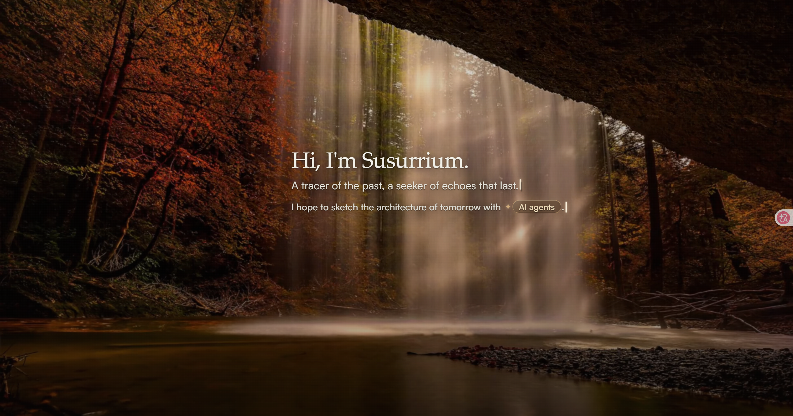
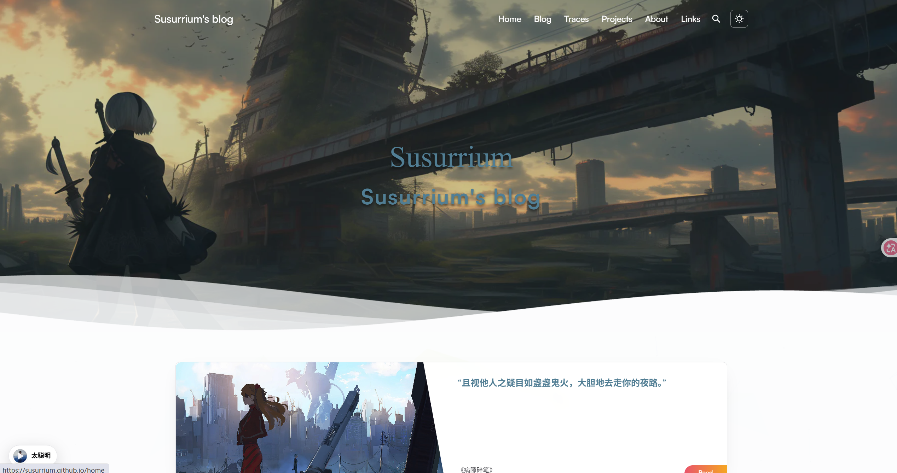
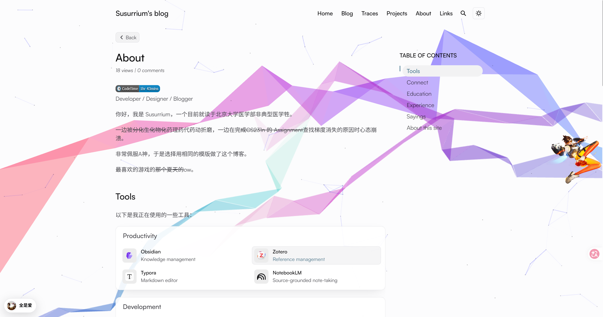
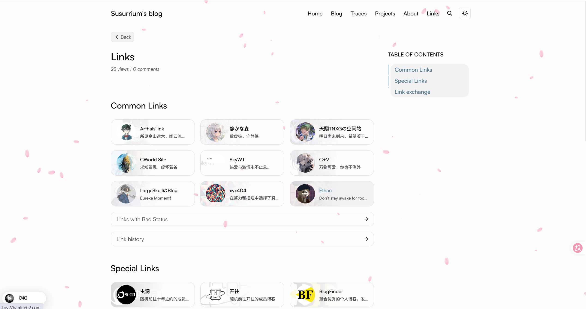
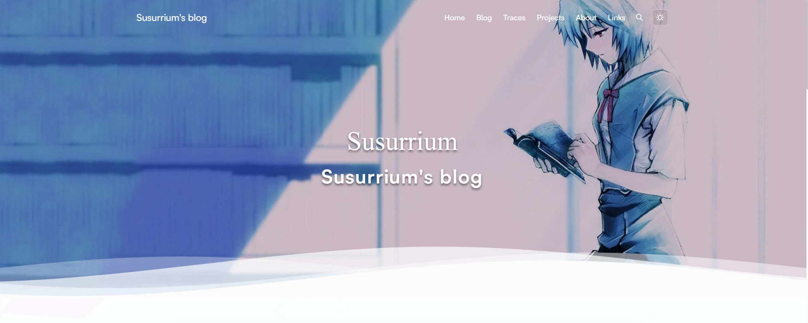
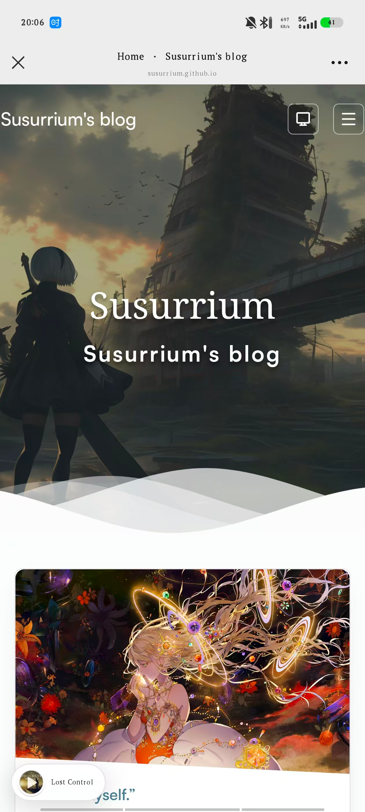
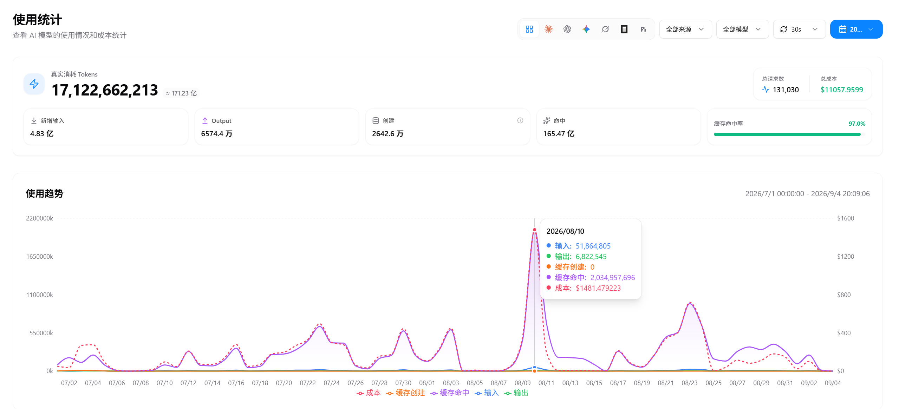
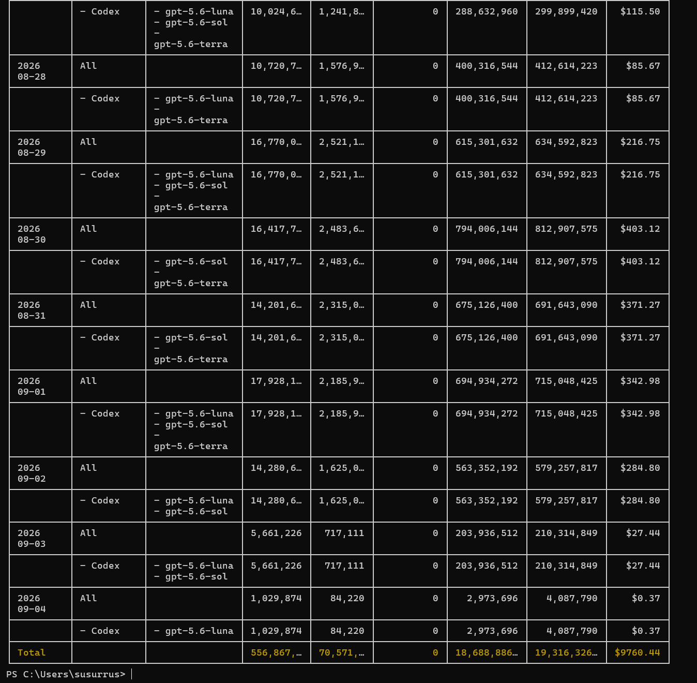

# Susurrium's blog 的开发记录

## 写在前面

很早以前，我就想有一个可以记录自己学习过程、积累能力和保存一些思考的地方。

如果这些内容还能被其他人看到，并且能够起到哪怕一点点启发或帮助，那就更好了。

我调研了许多，常见的内容发布方式大概可以分为三类：

1. 内容平台，例如知乎、微信公众号；
2. 技术社区，例如掘金、CSDN、博客园；
3. 个人博客。

第一类用户最多，涵盖的主题也最广，但参与者和内容都比较复杂。

第二类其实和我的需求比较接近，不过我总觉得自己能力有限，还不太配在上面发表太多内容，以免污染数据库😵‍💫😵‍💫

最后就是第三类个人博客。自己开发和部署个人博客确实麻烦很多，但它可以让我掌控内容、设计、交互、部署和维护的全过程。

它的缺点也很明显：可能没有人看，最后真正的读者大概只剩下自己。

不过这本来也不是我的主要需求，所以也就无所谓了。

开始做之前，我以为这只是一个简单的前端项目，应该很快就能完成。

但真正开始之后，我才发现：

> 做一个能打开的博客很容易，做一个自己愿意长期使用、愿意持续维护的博客，却没有想象中简单。

我的博客并不是一次完成的，而是经历了多次推翻重来，才有了现在的 [Susurrium Blog](https://susurrium.github.io/)。

回头看，我走的并不是一条高效的路线，甚至很可能是一条最差的开发路线（也许不只是开发，我到现在为止的许多关键选择好像都是这样）。

但正是这条并不顺利的路线，让我完整经历了一个前端项目从想法、实现、失败、重构，到最终上线的过程。

也让我逐渐理解了：

> 一个项目能运行，并不代表它真正完成了；只有当它值得被长期使用和维护时，才算真正完成。
>
> 特别是在这个 AI 时代，做出来本身已经越来越没有壁垒，真正需要更多思考的是：为什么做、做什么，以及它是否值得被长期维护。



*图 1：博客入口页，主要用于展示个人介绍和网站整体氛围。*




*图 2：博客首页桌面端效果，包含 Hero、导航和首页内容模块。*



*图 3：About 页面，集中展示个人信息、使用中的工具和网站说明。*




*图 4：Links 页面，包含友情链接、特殊链接和链接历史。*

# 一、现有功能

## 1.1 整体的前端外观和风格

现在的博客部署在 GitHub Pages：

https://susurrium.github.io/

如果只看 Home 页面，很容易把这个项目理解成一个带有一些动画效果的个人主页。

但实际上，Home 只是整个网站中的一个界面。

它负责展示一部分个人信息、最近内容和视觉元素，却不能代表整个项目。真正构成这个博客的，是统一的页面风格、内容系统、阅读体验、运行时能力和发布流程。

目前网站整体采用简洁、克制、适合阅读的视觉风格。

页面之间使用统一的字体、颜色、间距、圆角和卡片语言，同时支持浅色和深色主题。桌面端和移动端有不同的布局策略，文章阅读页面也会尽量减少无关的视觉干扰。

网站的整体体验包括：

- 统一的 Header 和 Footer；
- 响应式布局；
- 深色模式；
- 移动端导航；
- 页面预取和页面切换；
- 图片放大；
- 文章目录；
- 返回顶部；
- 代码高亮和代码复制；
- 数学公式；
- GitHub 风格提示块；
- 评论和访问量；
- 全局音乐播放器；
- 全局视觉效果；
- 减少动画模式；
- 外部资源失败时的降级。

这些能力并不属于某一个单独页面，而是整个网站的基础体验。

音乐播放器会在页面之间保持统一状态；主题切换需要在首次加载和页面切换时保持一致；视觉效果需要根据页面类型决定是否开启；文章阅读页面需要使用独立的目录、图片和内容布局。

Home 页面只是这些能力的一个集中展示场景。它目前包含 Hero、个人简介、随机 Saying、最近内容、Education、Residence 和 GitHub Activity 等模块，但这些只是网站信息的一部分。

## 1.2 文章系统

我不希望所有内容都被迫写成标准 Blog。

有些内容适合写成完整文章，例如学习笔记、技术文章和项目总结；有些内容只是一次开发过程或一个问题的记录；还有一些内容只是短句、引文或某个值得保存的表达。

因此，当前我把内容分成了三种类型：

- Blog；
- Trace；
- Saying。

这里的“类型”不只是普通 Tag。

Tag 更适合描述文章主题，而内容类型则决定了内容的语义、展示方式和阅读场景。

### Blog

Blog 用来保存比较完整的文章，包括：

- 学习笔记；
- 技术文章；
- 项目总结；
- 工具使用记录；
- 课程和实验记录；
- 对某些问题的完整思考。

Blog 文件位于：

```
src/content/blog/
```

### Trace

Trace 用来保存较短的过程记录。

它可以是一段调试记录、一次开发经历、一个临时想法，也可以是某个不值得写成长文、但又不想完全丢掉的片段。

Trace 文件位于：

```
src/content/traces/
```

### Saying

Saying 用来保存短句、引文和一些值得留下来的表达。

Saying 文件位于：

```
src/content/sayings/
```

这三类内容并不是简单共用一个 Blog 页面，而是分别拥有自己的列表、详情、标签、分页、卡片样式和阅读布局。

它们在底层共享一部分内容能力，但在语义和展示方式上保持区别。

目前，在写下这篇文章之前，Blog 和 Trace 还没有正式内容，Saying 已经有 5 篇。

这篇文章发布之后，Blog 也将真正开始拥有第一篇内容。

除了渲染 Markdown，内容系统还需要处理排序、分页、标签、首页推荐、相关推荐、搜索、归档和 RSS。

为了避免这些逻辑分散在不同页面中，项目建立了统一的内容数据层。

不同集合中的内容会先被转换为统一的内容记录，再交给页面、卡片和阅读布局进行展示。

当前项目只实现了 Blog、Trace 和 Saying 三种类型，但内容层和类型注册机制已经为以后增加 Projects、Notes、Publications 等类型预留了扩展空间。

## 1.3 其他页面

除了 Home 和文章页面，网站还包括多个相对独立的页面。

About 页面用于展示个人介绍，以及网站的一些技术说明。

Projects 页面用于展示项目、课程笔记、GPG 公钥和支持方式。

Links 页面用于展示友情链接、特殊链接、友链历史和本站链接信息。

此外，网站还提供：

- 全文搜索；
- Blog 年度归档；
- Blog、Trace、Saying 各自的标签页面；
- RSS；
- sitemap；
- robots.txt；
- 自定义 404；
- Promise 页面；
- 卡片裁剪审阅工具。

这些页面共同构成了一个个人空间，也是博客长期运行之后承载不同信息的入口。

## 1.4 小组件

网页上各处还有很多组件。

其中一部分来自 Pure 主题，也有一部分是我自己设计、改造或重新实现的。

它们包括：

- 全局音乐播放器；

- Waline 评论和页面访问量；

- GitHub 贡献热力图；

- CodeTime 卡片；

- Residence 地图；

- 文章目录；

- 图片灯箱；

- Hero 和卡片裁剪工具；

- 页面切换和运行时清理；

- 点击粒子、花瓣和陪伴元素；

- 移动端导航和交互控制。

如果你也喜欢这些小组件，欢迎将它们用在自己的博客上。


## 1.5 与上游的区别

当前项目以 Arthals-Ink 为起点，并根据自己的需求进行了重构和优化。Arthals-Ink 本身以 `astro-pure` 作为主题和组件基础，两者高度一致。

而我并不是把原站换一个名字重新发布，也没有试图保留所有原来的设计。

主要区别集中在内容模型、页面组织、运行时管理、资源策略、工程验证和部署方式上。

| 方面     | Pure / Arthals-Ink     | Susurrium Blog                              |
| -------- | ---------------------- | ------------------------------------------- |
| 站点入口 | 根路径直接进入主页     | 根路径是独立入口，主页位于 `/home`          |
| 内容模型 | 主要围绕 Blog          | Blog、Trace、Saying 三种内容                |
| 标签系统 | 以 Blog 标签为主       | 三类内容分别维护标签                        |
| 页面组织 | 标准个人博客结构       | 增加独立内容类型、标签和阅读策略            |
| 整体体验 | 主题和原站的成熟组合   | 在原有基础上加入新的页面能力和运行时管理    |
| 资源策略 | 使用原有资源和外部服务 | 增加本地媒体、资源审计和体积预算            |
| 外部功能 | 使用站点原有配置       | 重新整理音乐、地图、评论和统计边界          |
| 部署方式 | 上游配置偏向 Vercel    | 当前使用 GitHub Pages 静态部署              |
| 工程保障 | 基础构建和检查         | 增加 CI、浏览器回归、严格发布门禁和分支治理 |

也许有人更喜欢 Pure 那种风格统一、全局简约的设计，也有人会喜欢我现在这种更丰富的表达。

# 二、我的开发历程

## 2.1 第一次：完全从零开发

最开始，我没有使用现成主题，也没有 Fork 一个成熟项目，而是决定完全自己开发。

当时的想法很简单：先做一个个人主页，再慢慢增加博客、项目、友链、搜索、深色模式和文章详情。

这个过程让我第一次比较完整地接触了 Astro、Markdown 内容集合、Pagefind、静态构建、响应式布局和 GitHub Actions。

项目后来形成了一个雏形，并保存在 [Susurrium/homepage](https://github.com/Susurrium/homepage)。

它确实可以运行，但我始终不满意。

问题不一定是某一个具体的 Bug，而是整体感觉不对：

- 页面之间缺少统一的视觉语言；
- 首页结构比较松散；
- 数据和组件之间耦合较多；
- 很多功能只是“能用”，没有形成稳定的设计；
- 功能越加越多，代码却越来越难以继续扩展。

最重要的是，我自己不愿意继续使用它。

有时候，一个项目没有明显的技术错误，却依然会让人不想维护。因为它虽然完成了功能，却没有形成一个自己真正认同的整体。

于是，这个项目被我搁置了很长一段时间。

这次经历让我第一次意识到：

> 项目完成需求，不等于项目完成了。


## 2.2 第二次：尝试自己复刻 Arthals-Ink

后来到了暑假，我有了更多空闲时间，也有了 Tibo 提供的额度，于是决定重新开始。

这一次，我先回头分析了原本项目的问题，然后决定寻找一个更明确的参考方向。

这时我很自然地想到了 Arthals 的博客。

虽然我至今仍然不认识 A 神，但一直很佩服他。

Arthals-Ink 的 Blog 页面很简约，却有比较强的美感和整体性，尤其适合阅读相对严肃的文章。

不过，如果所有界面都完全保持同一种风格，网站可能又会显得过于单一。

所以，我希望文章阅读页面保持简洁和克制，而其他页面则可以更加多元、丰富一些，增加更多组件和属于自己的表达。

于是，我又开始参考其他博客和个人网站，把自己喜欢的部分拆出来，再加入自己的想法。

这个阶段的目标是：

> 先理解和复刻，再加入自己的设计。

刚开始，我以为这件事会简单很多。

毕竟参考站点已经存在，页面结构可以观察，视觉方向也比较明确。

但真正开始之后，我才发现，视觉效果只是表面，真正困难的是它背后的工程关系。

一个看起来简单的页面，实际上要考虑：

- Hero 图片在不同尺寸下如何裁剪；
- 图片主体如何避免被切掉；
- 桌面端和移动端是否需要不同构图；
- 动画在页面切换后是否会重复运行；
- 音乐播放器是否会重复初始化；
- 地图脚本是否应该延迟加载；
- 外部服务失败后页面是否仍然可用。

我花了很多时间尝试接近参考站点的效果，但最后的结果仍然不理想。

有些地方看起来像了，有些地方完全不像；有些效果在本地运行正常，换一个页面或视口就会出现问题；有些代码只是为了模仿表面效果而不断叠加，后续很难继续维护。

那段时间其实比较挫败。

因为投入了很多精力，却越来越清楚地看到，自己做出来的东西和目标之间仍然有距离。

## 2.3 第三次：Fork 之后重新整理

在自己复刻了一段时间之后，我最终决定直接 Fork Arthals-Ink。

这看起来像是退一步，但实际上只是换了一种方式继续做。

Fork 之后，我确实少解决了一些基础问题。主题、文章系统、搜索、目录、分页和很多组件都已经存在。

但 Fork 并不等于完成。

一个已有项目内部往往存在许多隐含关系：

- 改一个路由，可能影响导航、RSS、sitemap 和 canonical；
- 增加一种内容类型，可能影响卡片、标签、搜索和归档；
- 替换一张图片，可能影响裁剪、资源体积和授权记录；
- 接入一个外部脚本，可能影响页面生命周期；
- 更换部署平台，可能影响构建和工作流；
- 修改一个组件名称，可能影响历史配置和测试。

所以，Fork 之后真正开始的，并不是“改几个页面”，而是重新理解整个项目。

我需要判断哪些东西可以保留，哪些东西需要修改，哪些历史实现已经不适合当前目标，哪些功能应该重新设计。

Fork 解决的是起点问题，不是完成问题。

## 2.4 遇到的主要问题

### Hero 的补丁问题

Home 的 Hero 是我印象最深的例子之一。

一开始，我只是想调整图片的位置。后来发现桌面端和移动端需要不同的裁剪，于是增加了判断；又发现滚动到边界时表现不正确，于是继续增加滚动逻辑；之后发现固定媒体和 Hero 容器的高度不一致，只能继续补充计算。

补丁一层层叠加，最后虽然实现了想要的效果，但代码已经非常复杂。

最麻烦的是，我自己都很难判断下一次修改会影响什么。稍微改动一个尺寸，其他地方就可能完全失效。

最后，我不得不推翻之前的实现，重新设计 Hero 的数据结构、裁剪配置和可见性计算，并为它补充独立的测试。

这件事给我的教训很深：

> 在已有项目上增加功能之前，必须先判断：这是一个适合局部修补的问题，还是一个应该重新设计边界的问题。

这也是现在进行 AI Agent 编程时尤其需要警惕的问题。

AI 很容易快速生成一层“看起来能用”的代码，但如果问题本身属于架构边界，继续让它叠加补丁，最后往往只会得到一段更难维护的代码。



*图 5：桌面端 Hero 效果，重点展示背景裁剪和标题布局。*




*图 6：移动端首页效果，展示移动端布局、导航和音乐播放器。*

### 内容类型问题

原站以 Blog 作为主要文章类型，这对于一个成熟的技术博客来说没有问题。

但对我来说，单独使用 Blog 还是有些单一。

即使可以通过 Tag 区分主题，认真写的经验文章、教程和偶尔发的牢骚，放在同一个内容体系里，仍然显得不够合适。

我希望它们在内容层面就被区分开，而不是只依赖标签。

因此，我设计了 Blog、Trace 和 Saying 三种内容类型。

当我初步决定这样做之后，问题已经不再是“多写几个页面”。

三种内容的字段不同，展示目的不同，卡片不同，详情页也不同。

如果每个页面都自己读取数据、排序、处理标签和拼装卡片，项目很快就会重新回到最初那种难以维护的状态。

因此，我建立了统一的内容数据层。

不同集合先进入内容层，转换成统一记录，再由页面、卡片和阅读布局决定如何展示。

这套设计需要处理：

- 内容排序；
- 内容分页；
- 标签统计；
- 首页推荐；
- 相关推荐；
- 搜索范围；
- RSS 范围；
- 不同内容的阅读布局；
- Blog、Trace 和 Saying 为空时的展示。

这也是当前项目中最重要的一次架构变化。

我后来还发现，原始 Pure 主题本身也有人提出过类似的内容抽象问题。

以后如果有机会，我希望把其中一部分整理成能够反馈给上游的贡献，也许这会成为我的第一个贡献项目。

### 页面生命周期问题

动画和交互在第一次加载时通常不难，真正麻烦的是页面切换之后。

旧的事件监听、定时器、地图实例、音乐播放器状态，都必须被正确处理。

项目使用 Astro ClientRouter 后，页面不再总是通过完整刷新重新加载，因此运行时必须考虑：

- 页面切换后的清理；
- 浏览器返回和前进；
- 页面进入后台；
- 元素离开视口；
- 减少动画模式；
- 多次进入同一页面。

这让我意识到，前端效果并不是“把脚本加载进来”这么简单。

它还需要知道什么时候启动、什么时候暂停、什么时候销毁。

### 外部资源和失败降级问题

地图、音乐、评论、统计和 GitHub 数据都会涉及外部服务。

外部服务正常时，网站可以提供更丰富的体验；但它们不能成为页面能够显示的唯一条件。

因此，当前项目采用了多种降级策略：

- 入口视频失败时保留 poster；
- 地图失败时显示本地静态图；
- 地图接近视口时才加载；
- 部分媒体资源本地化；
- 文章中的远程资源需要审查；
- 减少动画模式下关闭非必要效果。

这让我逐渐明白：

> 一个稳定的网站，不是所有服务都永远正常，而是服务异常时仍然能够保持基本可用。

### 发布和历史整理问题

项目后期，问题已经不只是代码本身。

我还需要确认：

- 哪个分支才是生产版本；
- 历史检查点中的内容是否应该恢复；
- 哪些临时文件不应该进入仓库；
- 哪些旧组件已经被新架构替代；
- 哪些资源存在版权或隐私问题；
- 当前部署的是否真的是最新版本。

因此，项目后期增加了：

- Astro 类型检查；
- ESLint；
- 静态构建；
- 全量测试；
- 浏览器回归；
- 发布严格门禁；
- RSS、sitemap 和 canonical 检查；
- 外部资源检查；
- 静态资源体积预算；
- 友链健康检查。

这些内容不会全部直接出现在网站上，却决定了项目是否能够长期维护。

## 2.5 AI Agent 在这个过程中的使用

从这个项目诞生的契机开始，它就离不开 AI。

因为它正是某次我Codex额度用不完时决定正式开始的产物。

这个项目的许多工作，都离不开 Codex 和 Claude 老师的帮助。

项目中很多代码，我已经分不清哪些是自己手写的，哪些是它生成的。

不过我觉得也没有必要刻意区分。

代码最终进入了项目，就需要由我理解、判断、修改和承担后果。

我也经常听到一些类似的说法：“要是没有 AI，……”“一直使用 AI，你自己最后会变成什么样？”

这里简单谈一下我的和我看到过的一些暴论：AI 当然只是工具，但它是一个非常强大的工具。AI 当然只是工具，但它是一个非常强大的工具。

当一个人能够有效使用 AI 时，这种使用能力本身也会成为个人能力的一部分，并且是更重要的能力。

不过，AI 强大并不意味着人可以停止学习。

以我这次开发为例，Codex 给出的方案有很多次都很差，甚至很丑陋；

也有很多次我只让它完成一个很小的任务，最后仍然出现各种细小的 Bug。

所以，使用 AI 并不等于把关键判断交给 AI。

更准确地说，是让 AI 参与实现，但仍然由人决定目标、判断方案、承担结果。

人继续学习，不是为了回答“没有 AI 时我还能做什么”，而是为了理解问题、判断方案，并思考在拥有 AI 之后如何把事情做得更好。

想起看过的一个树洞，大致内容如下：

dz：AI 的出现，会不会让人类失去独立分析、判断和思考的能力？

某字母君：蒸汽机的出现，会不会让人类失去骑马的能力？
电气化的普及，会不会让人类失去亲手生火的能力？
计算机的出现，会不会让人类失去记忆与计算的能力？


这里顺便附上两张 Token 用量截图。



*图 7：cc switch统计面板，展示 Token 总量、请求数、成本和按日期变化的趋势。*




*图 8：ccusage的统计结果。*


# 三、现有架构

## 3.1 正式架构

当前项目使用 Astro 6.1.8 和 astro-pure 1.4.6，使用 Bun 管理依赖，最终构建为静态网站并部署到 GitHub Pages。

整个项目大致可以分成五层。

第一层是内容层。

Blog、Trace 和 Saying 都使用 Markdown 或 MDX 作为内容源，并通过 schema 校验字段。

第二层是内容数据层。

内容数据层统一读取不同集合，处理内容记录、排序、标签、分页、首页推荐和相关推荐。

第三层是页面与布局层。

页面路由位于 `src/pages/`，布局位于 `src/layouts/`，负责把内容组织成列表页、详情页、标签页和其他页面。

第四层是组件与运行时层。

组件负责卡片、文章阅读、地图、音乐、搜索、评论、视觉效果和个人信息展示。

运行时脚本则负责页面交互、资源加载、延迟初始化和生命周期管理。

第五层是构建与发布层。

Astro 负责构建静态文件，CI 负责检查和测试，GitHub Actions 负责把最终产物部署到 GitHub Pages。

整体数据流可以理解为：

```
Markdown / MDX
      │
      ▼
Content Schema
字段校验、日期和 draft 过滤
      │
      ▼
Content Catalog
统一内容目录
      │
      ▼
Page Data
排序、分页、标签、推荐和页面分组
      │
      ▼
Render Boundary
将统一记录还原为可渲染内容
      │
      ▼
Layouts + Components
页面布局和视觉组件
      │
      ▼
Astro Static Build
      │
      ▼
dist/
      │
      ▼
GitHub Pages
```

项目目录可以进一步展开为：

```
项目
├── 内容层
│   ├── src/content.config.ts
│   ├── src/content/blog/
│   ├── src/content/traces/
│   └── src/content/sayings/
│
├── 内容数据层
│   └── src/lib/content-layer/
│       ├── catalog.ts
│       ├── adapters.ts
│       ├── page-data.ts
│       ├── pagination.ts
│       ├── queries.ts
│       ├── tags.ts
│       └── reading-data.ts
│
├── 页面与布局层
│   ├── src/pages/
│   ├── src/layouts/
│   └── src/components/
│
├── 配置与资源层
│   ├── src/site.config.ts
│   ├── src/data/
│   ├── src/assets/
│   └── public/
│
├── 运行时与扩展层
│   ├── src/scripts/
│   ├── src/plugins/
│   └── packages/pure/
│
└── 工程保障层
    ├── scripts/
    ├── test/
    ├── docs/
    └── .github/workflows/
```

这种架构希望解决的问题是：

- 内容和页面展示分离；
- 数据读取和视觉组件分离；
- 页面能力和运行时能力分离；
- 开发代码和发布检查分离；
- 文章写作和功能开发分离。

以后写文章时，不需要重新理解整个项目；增加一种内容类型时，也不需要复制整套页面。


## 3.2 整个项目的开发架构

项目目前采用比较简单的 Git 分支结构：

```
upstream
  Arthals-Ink 的只读参考源
       │
       ▼
develop
  集成分支
       │
       ▼
codex/<topic>
  文章、功能、修复或文档分支
       │
       ▼
main
  生产分支
       │
       ▼
GitHub Actions
  CI、严格发布门禁和 Pages 部署
```

`main` 只保存已经确认可以发布的版本。

`develop` 用于日常集成，必须始终包含当前生产基线。

`codex/*` 是短生命周期分支，用来完成一篇文章、一个功能、一次修复或一项文档整理。

`upstream` 只用于读取和参考，不直接合并未经审查的内容。

项目的文档、脚本和测试也属于开发架构的一部分：

- `docs/` 记录流程、架构、来源和发布约束；
- `scripts/` 执行构建、资源、浏览器和发布检查；
- `test/` 约束内容层、组件、运行时和发布策略；
- `.github/workflows/` 执行 CI 和 GitHub Pages 部署。

# 四、开发使用

## 4.1 使用相同模板部署

当前项目可以作为一个个人博客项目的参考模板，但还不是完全抽象的通用主题。

复制之后，必须替换其中的个人资料、链接、图片、音乐和第三方服务配置。

首先复制项目并安装依赖：

```
git clone https://github.com/Susurrium/susurrium.github.io.git my-blog
cd my-blog
bun install --frozen-lockfile
```

项目要求：

- Node.js 22.12 或更高；
- Bun 1.4.0；
- Git。

然后修改站点基础配置：

```
src/site.config.ts
```

这里可以修改：

- 网站名称；
- 作者名称；
- 网站描述；
- 语言；
- 主导航；
- 页脚；
- 评论服务；
- 搜索配置；
- 友链申请信息。

个人资料和页面数据位于：

```
src/data/profile.ts
src/data/connect.ts
src/data/education.ts
src/data/experience.ts
src/data/entrance.ts
src/data/home-media.ts
src/data/residence.ts
src/data/music.ts
src/data/effects.ts
```

还需要替换：

- `public/` 中的头像、图片和视频；
- `public/links.json` 中的友链；
- `src/assets/` 中的个人资源；
- Waline、统计、地图和音乐配置。

如果部署地址不同，还需要检查：

```
astro.config.ts
```

确认站点 URL、基础路径和静态资源路径与实际部署地址一致。

最后运行：

```
bun run ci
bun run release:gate --strict
bun run links:check:dry
```

确认通过后，在 GitHub 仓库的 Pages 设置中选择 GitHub Actions。

当前部署工作流是手动触发的：

1. 将代码合并到 `main`；
2. 确认 CI 通过；
3. 在 GitHub Actions 中运行 `Deploy to GitHub Pages`；
4. 等待严格发布门禁通过；
5. 检查线上页面。

## 4.2 使用自己的博客

这个项目没有后台编辑器，文章和图片都通过 Git 仓库管理。

新增一篇 Blog，建议为它建立独立目录：

```
src/content/blog/
└── my-first-post/
    ├── index.md
    ├── cover.webp
    ├── architecture.webp
    └── screenshot.webp
```

使用 `index.md` 作为文章文件时，最终 URL 是：

```
/blog/my-first-post
```

文章基本格式如下：

```
---
title: 我的第一篇文章
description: 这是文章简介。
publishDate: 2026-09-04
tags:
  - Blog
  - 开发
language: 中文
draft: false
heroImage:
  src: ./cover.webp
  alt: 文章封面描述
---

正文从这里开始。


```

Blog 至少需要：

- `title`；
- `description`；
- `publishDate`。

如果暂时不希望公开，可以设置：

```
draft: true
```

### 上传封面图片

封面图片可以和文章放在同一个目录中：

```
src/content/blog/my-first-post/cover.webp
```

然后在 frontmatter 中引用：

```
heroImage:
  src: ./cover.webp
  alt: 文章封面描述
```

封面图片需要注意：

- 使用相对路径；
- 填写准确的 `alt`；
- 尽量压缩体积；
- 优先使用 WebP 或 AVIF；
- 确认图片来源和使用权；
- 不要直接提交未经压缩的大尺寸原图。

### 上传正文图片

正文图片也可以放在文章目录中：

```
src/content/blog/my-first-post/architecture.webp
```

Markdown 中使用相对路径：

```

```

这种方式适合只属于某一篇文章的图片，文章和图片放在一起，迁移和维护都比较方便。

如果一张图片需要被多个页面使用，也可以放在：

```
public/images/blog/my-first-post/
```

正文中使用：

```

```

两种方式的区别是：

- 文章目录中的图片：适合文章专用的封面和插图；
- `public/` 中的图片：适合多个页面共用，或需要固定公开 URL 的静态资源。

### 上传视频和音频

文章中的视频和音频建议放在：

```
public/media/blog/my-first-post/
```

再在 MDX 或允许 HTML 的正文中引用。

视频和音频需要额外检查：

- 文件是否过大；
- 是否有版权；
- 是否影响页面加载；
- 是否需要 poster；
- 移动端是否可用；
- 是否被发布门禁识别为未登记外部资源。

文章和图片添加后，使用 Git 提交：

```
git add src/content/blog/my-first-post
git commit -m "docs: add my first blog post"
git push
```


## 4.3 继续功能开发

功能开发从最新的 `develop` 开始：

```
git fetch origin
git switch develop
git pull --ff-only origin develop
git switch -c codex/<topic>
```

开发时尽量按照职责修改文件：

- 页面路由放在 `src/pages/`；
- 页面组件放在 `src/components/`；
- 数据配置放在 `src/data/`；
- 通用逻辑放在 `src/lib/`；
- 浏览器脚本放在 `src/scripts/`；
- 测试放在 `test/`；
- 流程和来源记录放在 `docs/`。

完成后运行：

```
bun run ci
bun run release:gate --strict
bun run links:check:dry
```

确认通过后：

```
git status
git add <需要提交的文件>
git commit -m "feat: describe the change"
git push -u origin codex/<topic>
```

然后创建：

```
codex/<topic> → develop
```

的 Pull Request。

## 4.4 反馈或参与这个项目

如果发现问题，可以通过 GitHub Issues 反馈，并尽量说明：

- 使用的系统和浏览器；
- 出现问题的页面；
- 复现步骤；
- 实际结果；
- 期望结果；
- 控制台错误；
- 必要时附上截图或录屏。

如果是功能建议，最好说明使用场景，而不是只描述希望增加什么。

例如，与其说“增加音乐功能”，不如说明：

> 希望在文章阅读时保留音乐状态，但不要让播放器遮挡正文。

这样更容易判断需求属于页面设计、运行时逻辑，还是外部服务问题。

如果希望提交代码，建议保持 Commit 单一、清晰、可审查：

```
feat: add a new content type
fix: clean music lifecycle
docs: update image usage guide
test: cover empty archive state
chore: archive historical records
```

不要把框架升级、页面重构、资源替换和功能开发全部混在一个 Commit 中。

# 五、最后

## 5.1 一些杂谈

AI 确实很强。

但也正因为 AI 很强，我反而更明显地意识到，自己还有很多东西需要学习。

这个项目中有无数次，AI 给出的方案、架构和代码都非常差，甚至可以说很丑陋。

也有很多次，我只是让它完成一个很小的任务，最后仍然出现各种细小的 Bug。

所以，AI 能够提高开发速度，却不能代替判断。

它可以帮我完成实现，但不能替我决定什么值得做、什么应该舍弃，也不能替我承担项目最后的结果。

这次开发让我学到的，不只是 Astro、Markdown、页面布局或动画效果。

我还逐渐理解了：

- 为什么需要先设计内容模型，再设计页面；
- 为什么组件不能只按视觉区域随意拆分；
- 为什么动画必须考虑生命周期；
- 为什么外部服务必须准备降级方案；
- 为什么静态网站也需要测试和发布门禁；
- 为什么历史文件不能简单恢复或删除；
- 为什么 Git 分支和提交记录也是项目的一部分；
- 为什么有些问题应该打补丁，有些问题则必须推翻重来。

以前我会把“页面效果”看成最重要的目标。

现在我会同时关注：

- 结构是否清晰；
- 数据是否统一；
- 组件是否可维护；
- 移动端是否合理；
- 页面切换是否安全；
- 外部服务失败后是否仍然可用；
- 构建和部署是否稳定；
- 以后自己还能不能看懂。

这个过程离不开 Codex 老师的帮助。

它参与的不只是代码生成，还包括结构分析、架构拆分、问题定位、测试设计、分支整理和发布验证。


## 5.2 后续更新计划

现在博客已经完成了基础建设，也已经部署上线。

接下来的主线任务，肯定是发布 Blog、Trace 和其他内容，希望能够坚持更新，不要鸽掉。`¯\_(ツ)_/¯`

支线任务则可能是继续优化和完善网站，尤其是研究能不能把它做成一个更加通用、更加方便直接部署的博客模板。

另外，我也希望继续整理内容数据层和相关架构，看看能不能将其中一些改进反馈给 Pure，或者形成自己的第一个开源贡献。

从完全自己开发，到尝试复刻，再到 Fork 和重构，我走了一条并不直接的路。

但也正是这条路，让我从“做出一个页面”，逐渐走向了“完成一个可以维护的项目”。

现在，网站已经准备好了。

接下来，应该真正开始写文章了。


P.S.：博客中有一个隐藏彩蛋。如果你认为自己发现了（需要解释发现过程，以防使用不正当手段），可以来找我确认并领取神秘奖励。😎😎
