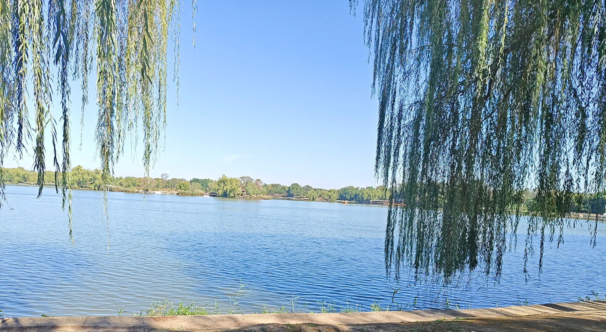

又是一年国庆，还算有点空闲时间（其实是实在学不进去了，也玩不下去了），想随便写点东西。跟国庆没有什么关系，只是到了这个时间点，又生出一点感想罢了。

二十岁好像确实有点特别。到了稍微有点意义的日子，我总会不由自主地想：去年这个时候我在干嘛，上上年呢，下一年又会怎样呢？

但往往也想不出什么答案。说来也好笑，连去年国庆自己干了什么，我一开始都没想起来。

还是晚上去找台球厅，不知道谁突然提了一嘴：“这是不是就是上次来的地方？”我们几个就跟着说“很像”“还真是”。

被这么一提，死去的记忆开始攻击我，一下子全想起来了。去年国庆，也是和这几个人一起出来玩（不过上次只有邓哥、硕哥和ghy，这次还多了天哥、~~wjz~~zzy 和 ljh）。那天应该也是差不多晚上的时候，我们决定去私人影院看电影，看的是《星际穿越》（PS:挺好看的电影）。

两个地方到底像不像，我也说不清，只记得都在挺高的楼里。这里还是得吐槽一下北京：找个地方玩，不是在地下，就是藏在楼里面，生怕别人找到。

去年影院具体是什么样子，已经有些模糊了。可大家这么一说，那晚一起出来玩的事又像是昨天才发生的。

这一天说是出去玩，其实主要在走路。路上聊些有的没的，聊来聊去，最多的话题还是学业和升学。虽然前些天我才说，[比较认同《我们不要再聊 AI、绩点、科研、实习、vibe-coding 了》中的一些观点](https://susurrium.github.io/traces/%E5%8F%AF%E6%98%AF-%E7%94%9F%E6%B4%BB%E5%B9%B6%E4%B8%8D%E6%98%AF%E7%8E%B0%E5%AE%9E%E7%9A%84%E5%8F%8D%E9%9D%A2/)，但：

> 我们貌似还是活成了自己最讨厌的样子。

这似乎也很难避免。毕竟大家的专业、学校，甚至所在的城市都不同，平时经历的事越来越不一样，能一起聊的话题似乎也少了。但学业、升学，确实是大家共同面对的困境。说起这些，大家至少还能理解彼此。

当然，大家的压力又各不相同。有被学校的数据蒙骗、决定考研的，有担心跨考能不能成功的，有忧虑自己能不能保到清华的，也有不知道心仪方向的导师愿不愿意接收自己的，还有纠结该选中科院强所还是弱所的。也有去向基本已经确定，却又担心能不能做出成果的。

但这一天，我还是觉得没有白过。说的还是那些事，可和这几个人面对面、漫无目的地边走边聊，本身就是件难得的事。大家已经在不同的地方过着不同的生活，还能这样凑到一起，听听彼此最近在想什么、烦什么，现在想起来，还是很喜欢这种时候。

其实写到这里，我也不知道自己究竟想表达什么。或许是觉得大学和网络反而让人与人之间远了，或许是拿这些压力没办法，只好在这里发几句牢骚，或许是又过了一年，对自己的年龄有些焦虑。又或许，只是还惦记着圆明园东湖边，和他们一起待着的那一会儿？

写到最后，突然想起路上 ljh 说我变化好大，好像一下子成熟了许多。我也觉得，自己的变化在同行几人里算大的（ghy 的长发另说)。

成熟不敢讲，但大学这一年，确实让我看清了许多，想明白了许多，也发现自己过去有些想法实在幼稚。

可代价呢？

再想想，前面二十年，我就没有过这种“我很成熟”的想法吗？谁又能保证，以后的我再看今年的自己，不会觉得幼稚呢？
